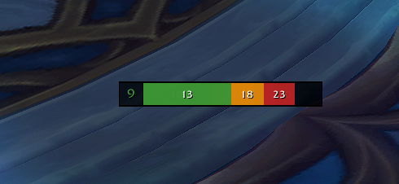

# AbundanceTracker

Help you know when to ramp reju and when to go ham

## Usage

Type `/abt` or `/abundance` to open the configuration window.

- `/abt lock` locks the bar
- `/abt unlock` unlocks the bar for dragging
- `/abt reset` resets the bar position

## Inspiration

https://www.curseforge.com/wow/addons/atonementbar
